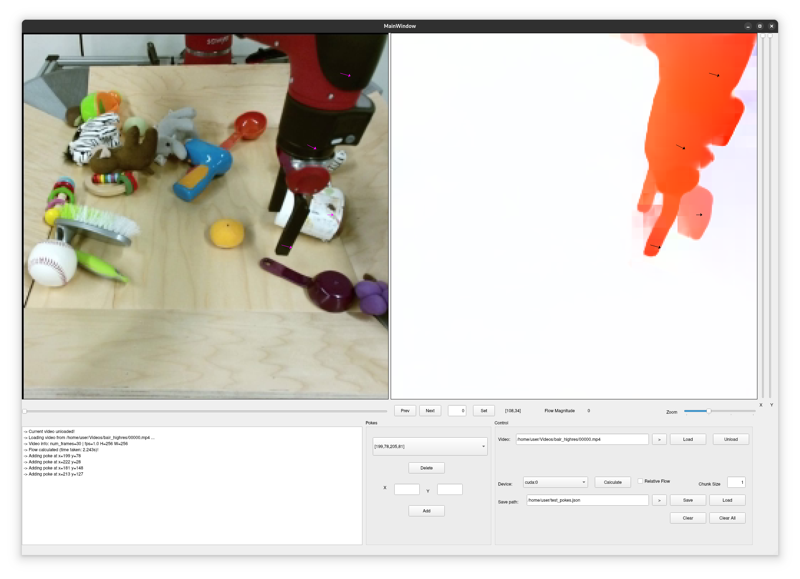

# poke_picker
A small tool for selecting sparse pokes given a Video.
Flow calculation is done via RAFT (different choices may follow).

 

## TODO:
- [] Add support for multiple flow estimation methods (e.g. Videoflow, ...) and trackers (e.g. BootsTAP, CoTracker,...)
- [] Draw arrows to better poke selection

